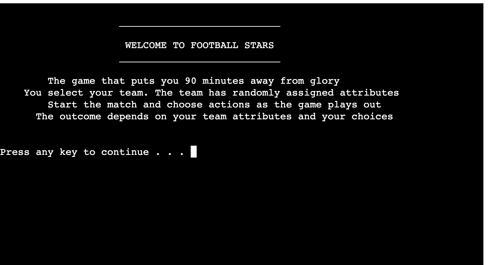
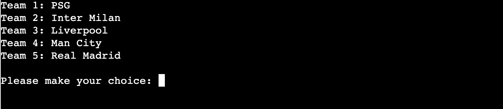
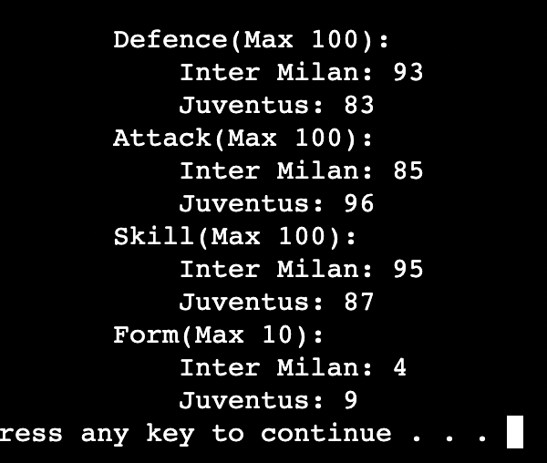
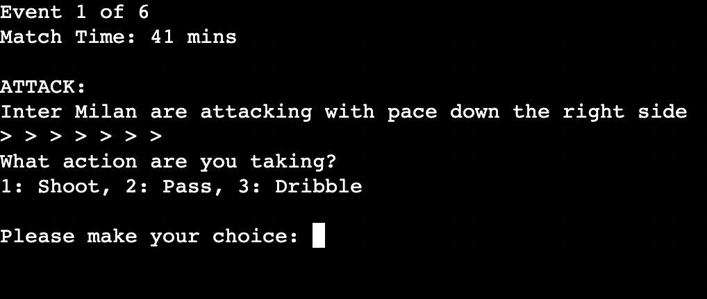
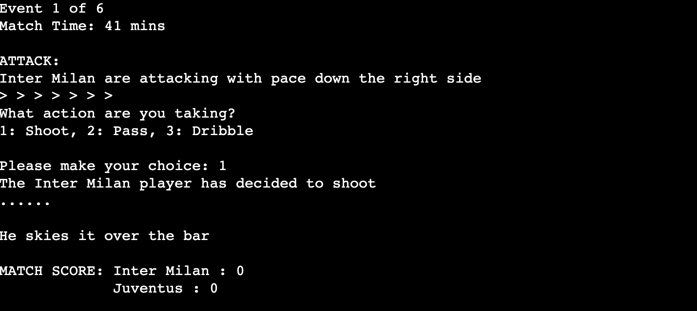
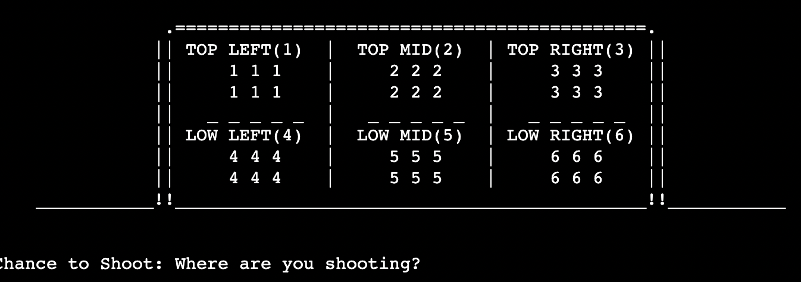
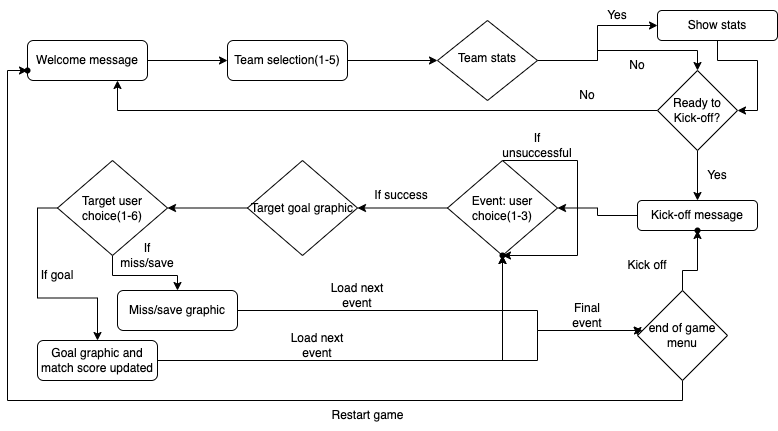

# Football Stars

Football Stars is a text-based game where everything is determined by the randomly generated statistics. You will never experience the same game twice.

The live website on Heroku can be accessed at the following link: [View my Live Website on Heroku here](https://football-stars.herokuapp.com/)

## CONTENTS

* [Features](#features)
    *  [Team selection](#team-selection)
    *  [Team statistics](#team-statistics)
    *  [Game events](#game-events)
    *  [Attack/defend](#attack-and-defend-events)
    *  [Targets and Outcomes](#targets-and-outcomes)
    *  [Input Validation](#input-validation)
    *  [Ascii Art](#ascii-art)
* [User Experience](#user-experience)
    *  [User Stories](#user-stories)
* [Design](#design)
* [Technologies](#technologies)   
    *  [Languages](#languages)
    *  [Frameworks, Libraries and Programs](#frameworks-libraries-and-programs)
* [Testing](#testing)
    * [Validation Testing](#validation-testing)
    * [Bugs](#bugs)
* [Deployment](#deployment)
* [Credits](#credits)

## Features

### Existing Features
- #### **Introduction**
    - Clear and simple outline of the game

- #### **Team Selection**
    - The game has 10 preset team names.
    - The user is presented with a list of 5 of those randomly chosen

    - The user selects the team.
    - Their choice of team is then removed from the team list and 1 of the reamining teams is chosen as the opposition.

- #### **Team Statistics**
    - Once the teams are selected, their ratings(statistics) are generated.
    - Each of the team stats(attack, defend, skill) are randomly generated from a range of 80-100 except for Form which is between 3-10
    - Based on the stats generated, the difference between home team attack and opposition team defence is stored as attdiff and vice versa called defdiff. Last stat is called skilldiff
    - These stats are effected by form also
    

- #### **Game events**
    - The number of game events are determined randomnly from 5-8
    - Based on number of events, the match times of these events are determined.
    - The type of event that occurs(attacking or defending) is then decided

- #### **Attack and Defend events**
    - Depending on the type of event(attack or defend), the text and graphics used are different
    - With the above image, you can see that it is labelled as ATTACK. The three choices offered are attack-specific.

- #### **Targets and Outcomes**
    -  When a user makes a choice, the game checks against the randomly generated stats to see if the user choice will lead to a goal chance or not.
        - If yes, then they are shown a goal graphic and get to choose where they want to shoot/dive
        - If no, it will display a message explaining that the chance is over.
    - The number of targets that will return a goal if use selects them are decided by the team stats generated at the start of game

- #### **Input Validation**
    -  There is one function for number input validation and one for string validation. They are called from within functions as required and returns the validated input.

[Number Input Validation](./readmeimg/input_num_validation.png)

[String Input Validation](./readmeimg/input_string_validation.png)

- #### **ASCII Art**
    -  To help improve the visual feel of the game, there is some use of ASCII art

### Future Features
- Improve the graphics with colour
- Have more customised event descriptions with specific player names
- Create the ability to play as one team against the others in a league-type format or knockout cup

## User Experience
A number of features have been added to improve the user experience while using the app. These include adding a pause between lines of text appearing to avoid overloading the user with too much information at one time. Also, the screen is cleared periodically to ensure the screen is clean and more appealing. The user is asked whether they would like to proceed with the game rather than moving on automatically.

### User Stories
#### User Goals
- As a user, I want to know what the game is about. Instructions are clear and concise. **Passed**
- As a user, I wanted to be able to decide what I wanted to do next.
    * I tested that they could start/kick-off/quit/etc as they wanted. **Passed**
- As a user, I wanted to be able to see the information about the game event as it arrived.
    * I tested that the event number, match time, match score appeared as intented for all events. **Passed**
- As a user, I wanted to know what options I had for each event.
    * I tested that the choices were presented correctly and clearly to the user at each event. **Passed**
- As a user, I wanted to know what options I had for each event.
    * I tested that the choices were presented correctly and clearly to the user at each event. **Passed**

## Design
- The design of the game is simple and straightforward. Text-based game with defined number of choices offered to user at each stage. For each event, customised event descriptions are displayed. Based on those choices, it can lead to a goal chance and a goal graphic is displayed and the user selects where they want to target their shot. If it's a goal, then the score is increased.

## Technologies

### Languages
- Python

### Frameworks, Libraries and Programs
- [GitHub](https://github.com)
- [Gitpod](https://gitpod.io/workspaces)
- [Heroku](https://www.heroku.com)
- [Chrome Dev Tools](https://www.google.com/intl/en_ie/chrome/)
- [Draw.io](https://app.diagrams.net/) for flowcharting

## Testing

### Validation Testing
- The code was run through the [Code Institute Python Linter](https://pep8ci.herokuapp.com/) and showed no errors.
[CI Python Linter Result Image](./readmeimg/pep8test.png)
- I used the user stories to perform manual testing on the quiz to see whether there were any blockers to the user goals identified above. The results are listed above in the [User Stories](#user-stories) section

## Bugs
### Fixed Bugs
- Attack and defend events were giving the same outcomes(chance to score).
- Defend/Attack player choices would all lead to goal chances.
- Hitting Enter would quit the app.
- Opposition team goal total was increased even when shot missed
- Check_start function was giving same message and needed custom messages trhu if statement
- random.sample gave a deprecation warning when ran in heroku so i replaced it with random.sample and random.choices where applicable

## Deployment
The project was deployed on Heroku using the following method:
1. Add dependencies in GitPod to requirements.txt file with command "pip3 freeze > requirements.txt"
2. Commit and push to GitHub
3. Go to the Heroku Dashboard
4. Click "Create new app"
5. Name app and select location
6. Add Config Vars for Creds and Port in Settings tab
7. Add the buildbacks to Python and NodeJS in that order.
8. Select appropriate deployment method e.g. GitHub
9. Connect to Github and link to repo
10. Enable Automatic Deploys

## Credits
- https://github.com/joeyespo/py-getch for the pause element
- all Text graphics generated at: https://patorjk.com/software/taag/#p=display&h=2&v=1&f=Slant&t=FOOTBALL%0A%20%20%20%20%20%20%20GAME
- Goal grpahics found at https://asciiart.website/index.php?art=sports%20and%20activities/soccer and modified by me
- Print delay feature found here: https://stackoverflow.com/questions/4627033/how-to-print-a-string-with-a-little-delay-between-the-chars
- readme template from https://github.com/Christo107/Training_Quiz/blob/main/README.md#training-evaulation-quiz